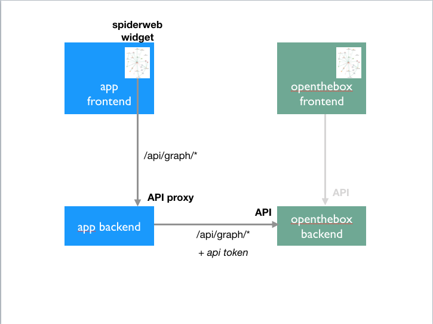
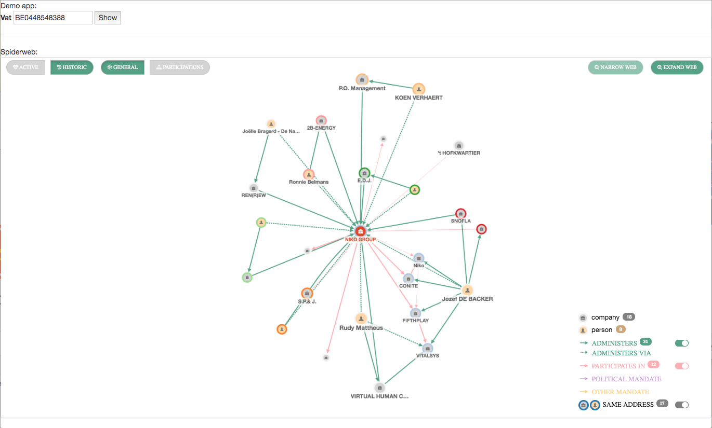

# openthebox spiderweb widget

### Overview

The openthebox.be spiderweb widget is a javascript package that makes it very easy to integrate the openthebox.be spiderweb into your own website. It offers the same interactive experience as the original spiderweb like the ability to expand nodes or filter specific relationships, while allowing full customization of the look and feel to make it fit in perfectly into your own website.

### Architecture

The spiderweb widget should be included in the front end of your application ("app frontend"). It will communicate with the openthebox web server ("openthebox backend") via your own web server ("app backend"). In other words, your own web server will proxy the communication.



### API calls

The spiderweb widget will make REST API requests to {api url}/api/graph/*

These requests should be proxied by your own application server and forwarded - while including your api token in an ```authorization: Bearer``` header - to the openthebox.be server.

The {api url} is configurable when instantiating the Openthebox.Spiderweb class and typically starts with your domain name, e.g. https://my-server.com/openthebox

You can generate an api token from the client id and client secret that comes with your openthebox.be subscription as following:

```curl
curl --request POST \
  --url https://opentheboxbe.eu.auth0.com/oauth/token \
  --header 'content-type: application/json' \
  --data '{"client_id":"{your client id}","client_secret":"{your client secret}","audience":"https://openthebox.be/api","grant_type":"client_credentials"}'
```

[Examples in other languages](https://auth0.com/docs/api/management/v2/get-access-tokens-for-production)

This token will expire after 24 hours so a new token should be generated before then  

### Usage
The spiderweb widget can be activated as following:

1] html
```html
<head>
  <!-- optional -->
  <link rel="stylesheet" href="/openthebox/assets/css/bootstrap/css/bootstrap.min.css">

  <!-- optional -->
  <link rel="stylesheet" href="/openthebox/pkg/css/app.css"/>
</head>

<body>
<!-- optional, not needed if jquery is already available -->
<script src="/openthebox/assets/libs/jquery/dist/jquery.min.js"></script>

<script src="/openthebox/pkg/libs.js"></script>

<script src="/openthebox/pkg/js.js"></script>

<!-- the spiderweb widget -->
<div ng-app="openthebox" ng-controller="spiderwebCtrl" id="spiderwebScope">
  <ng-include src="'/openthebox/app/spiderweb/template.html'"></ng-include>
</div>
<body>
```

2] javascript
```javascript
// assuming that the API endpoints are located on https://my-server.com/openthebox/api/graph and the images are located on /openthebox/assets
var spiderweb = new Openthebox.Spiderweb(apiUrl="https://my-server.com/openthebox", assetsUrl="/openthebox/assets")

//either show a company by vat number:
spiderweb.show("BE0448548388", "Company")

// or show a person by person id
spiderweb.show("123456", "Person")
```

[Example](index.html)


### Directory structure

```
+-- openthebox
|   +-- app
|       +-- spiderweb
|           +-- template.html       <-- location is configurable (see index.html ng-include src)
|   +-- assets
|       +-- css
|           +-- bootstrap           <-- optional
|       +-- images
|           +-- glyphicons          <-- location is configurable (see Openthebox.Spiderweb's assetsUrl)
|       +-- libs
|           +-- jquery              <-- optional: not needed if jquery is already available
|   +-- pkg
|       +-- css                     <-- optional
|       +-- fonts                   <-- optional
|       +-- libs.js
|       +-- js.js
+-- index.html
```

### Javascript dependencies

- jQuery 3.3.1 (or use your own)
- AngularJS 1.7.5
- qTip2 3.0.3
- Cytoscape 3.2.12


